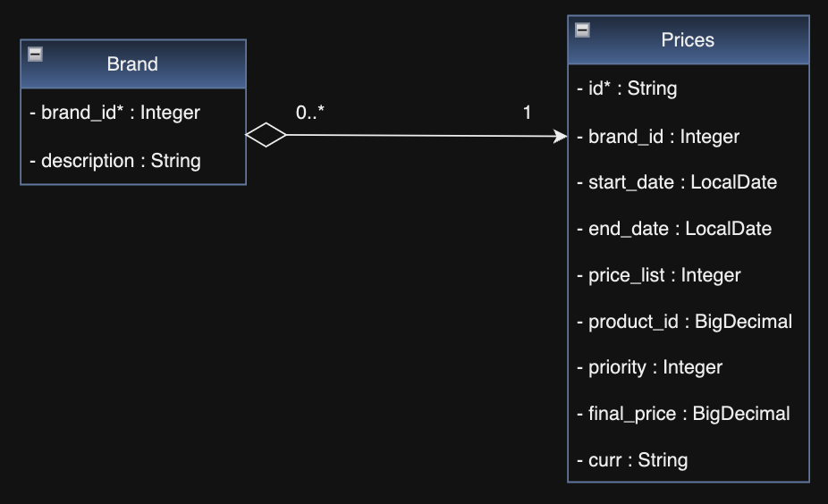
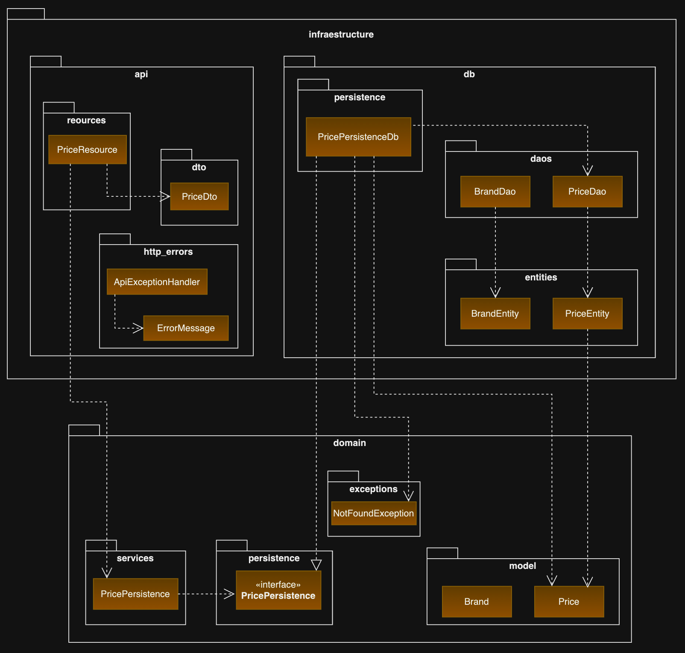

## Description
> Spring Boot application to create microservice. Built an API REST with one end-point for consult final price (pvp) 
> and tariff depending on specific dates.

## Table design


## Hexagonal architecture


## Technologies
`Java` `Maven` `GitHub` `Spring-boot` `H2` `Postgresql` `Sonarcloud`

## Code status
[](https://github.com/prodang/ecommerce-prices/actions/workflows/ci.yml)
[](https://sonarcloud.io/summary/new_code?id=itx-piero-rodriguez)

## :gear: Install
1. Clone respository, **console**:
    * ecommerce-prices
        ```sh
        > cd <folder path>
        > git clone https://github.com/prodang/ecommerce-prices
        ```
2. Import project with **Intellij** 
   * Select pom.xml > Open as Project
3. Import **Postman** collection
   * Select `/docs/Prices.postman_collection.json`
4. Execution
    * Tests: use H2 Embedded
    * Local:
      1. BBDD. Execute Postgresql: `//localhost:5432/itx`
      2. Spring. Execute in terminal: `./mvnw clean spring-boot:run`
      3. Swagger. Web Client (OpenAPI): `http://localhost:8081/swagger-ui.html`
